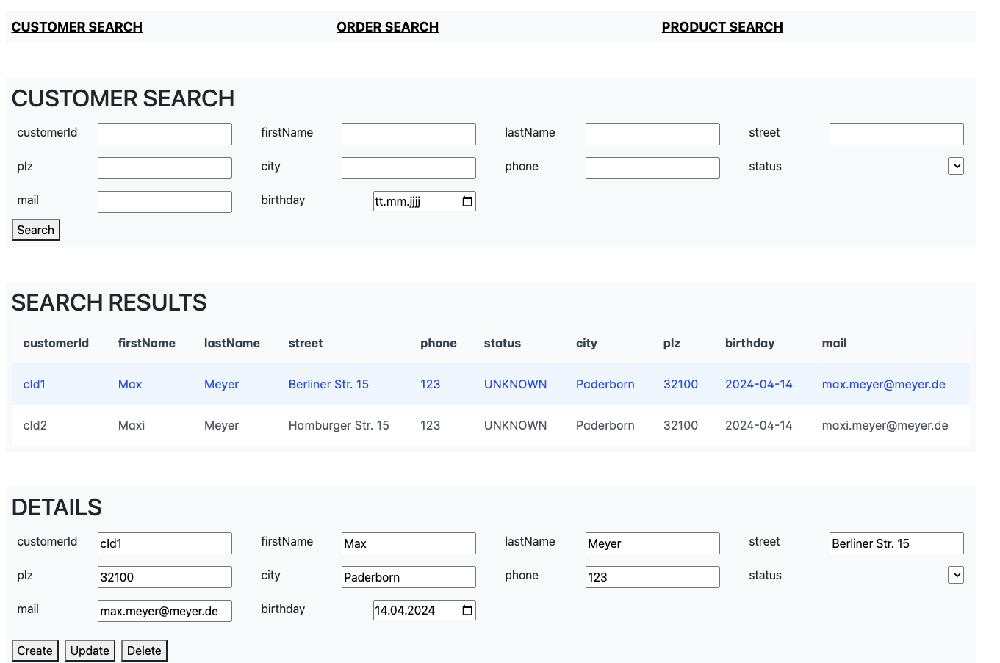

Stellen Sie sich vor, ein Kunde hat große Pläne für eine grafische Benutzeroberfläche (GUI). Diese GUI soll Kundendienstmitarbeitern und Administratoren helfen, eine Vielzahl von Datensätzen zu verwalten. Klingt nach einer gewaltigen Aufgabe, oder? Nun, der Kunde hatte jedoch ein Problem: Er verfügte über keine Frontend-Entwickler und wollte Zeit und Geld sparen.

## Das Szenario (stark vereinfacht)

Unsere Zielgruppe sind Kundendienstmitarbeiter, die Daten zu Kunden, Bestellungen und Lieferungen bearbeiten müssen. Jeder dieser Bereiche hat seine eigene Bildschirmmaske. Klingt nach einer Menge Arbeit, oder? Sollen alle Bildschirmmasken einzeln implementiert werden? Und die Anbindung ans Backend? Nein! Wir werden Konfigurationsdateien verwenden, dann funktioniert fast alles automatisch.

## Die Antwort: Konfigurationsdateien

Die Idee ist einfach, aber mächtig: Bildschirmmasken aus Konfigurationsdateien generieren. Diese Dateien enthalten Attribute wie Name, Berechtigungen, Endpunkte und Suchfilterkriterien. Und voilà! Anhand dieser Informationen wird der Bildschirm automatisch erstellt. Ein bisschen wie Zauberei, oder?

## Warum ist das ein Erfolg?

- **Zeit und Geld sparen:** Stellen Sie sich vor, jede Bildschirmmaske müsste einzeln implementiert werden. Ein Albtraum, oder? Nicht für unseren Kunden! Dank der automatischen Generierung sparte er Zeit und Geld.
- **Erweiterbarkeit:** Nicht-Entwickler können jetzt weitere Bildschirmmasken hinzufügen. Einfach die Konfigurationsdateien hinzufügen und los geht’s!
- **Automatisierung:** Alles wird automatisch generiert. Auch die Anbindung an das REST-Backend. Der Wartungs- und Testaufwand? Drastisch reduziert!
- **Bonus-Features:** Unser Kunde profitierte von i18n (AOT) und der Generator wurde in eine eigene Bibliothek extrahiert.

Code auf GitHub: [christoph-sens/flexible-ui-cool](https://github.com/christoph-sens/flexible-ui-cool)

## Beispiel

Anhand dieser Konfigurationsdatei wird die untere Bildschirmmaske generiert.

```json
{
  "model": "customer",
  "apiEndpoint": "api/customers/",
  "permissions": "CRUD",
  "identifier": "customerId",
  "attributes": [
    { "name": "customerId", "type": "String" },
    { "name": "firstName", "type": "String" },
    { "name": "lastName", "type": "String" },
    { "name": "street", "type": "String" },
    { "name": "plz", "type": "number" },
    { "name": "city", "type": "String" },
    { "name": "phone", "type": "number" },
    { "name": "status", "type": "enum" },
    { "name": "mail", "type": "String" },
    { "name": "birthday", "type": "date", "isReadOnly": true }
  ]
}
```


