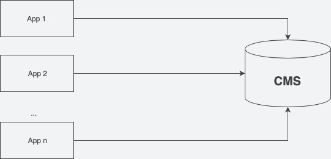

A large media group offers a portfolio of more than 10 mobile apps. Each of these apps was built with a different technology by a different external service provider. This creates complexity, and the technical know-how sits outside the company. That is why the decision was made to bring app development in-house.

## Goal: create a common technology base

The goal is not to move all apps onto one technology platform at the same time. Given the effort involved, that would simply not be feasible. What can be done, however, is to build all new development on the technology platform. This includes relaunches of existing apps, e.g. Super News App V2. The older apps therefore continue to be run by the external service providers.

Reaching this goal requires two tasks:

- **Defining a common technology base.** The technology should be chosen with as long-term a perspective as possible.
- **Identifying what the apps have in common.** The aim is a uniform technology core. Shared functionality should be implemented only once.

## Choosing the technology: Flutter as the right choice

I put together a market overview of the technologies used for app development over a period of several years. Three technologies stood out in particular: Flutter, React Native and Cordova.

Cordova was ruled out right away. Its market share (<10 %) had declined sharply over the past few years. Starting new development on a technology that is already dying is never a good idea.

The remaining market share of about 80 % was split between Flutter and React Native. It was also striking that Flutter’s adoption had grown strongly in recent years, while React Native’s market share had stagnated at around 40 %.

We built prototypes with both technologies. Both are great, and there are numerous examples of prominent apps built with each of them. In the end, though, I recommended Flutter.

With Flutter and Dart, I simply felt more productive. Setting up the project involved fewer complications, and missing information was easier to find in the good documentation. That matters especially when new developers join the project.

## Identifying commonalities: a uniform technology core

The group’s entire content (e.g. news articles) is managed in a content management system (CMS). The content for the apps is also delivered from it. It follows that every app needs access to the CMS.

Access via REST was provided once, in a library. Every app can use this library and doesn’t have to implement the CMS connection itself. The advantage: when something changes or a bug needs fixing, it only has to be maintained in one place.

## Results: two successful apps and higher efficiency

The project proved a complete success. The media group successfully published two new apps in the App Store and Play Store, with Flutter as the technology platform. The decision for a common technology base brought the necessary know-how into the business unit. Identifying what the apps had in common increased efficiency and productivity in development. Using a central interface reduced the maintenance and development effort. All in all, the media group revolutionized its app development and is now better equipped for future challenges.
